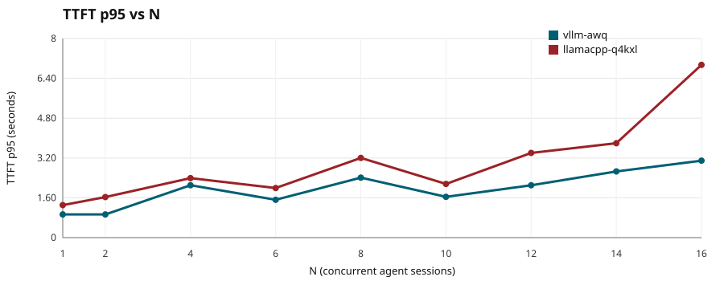
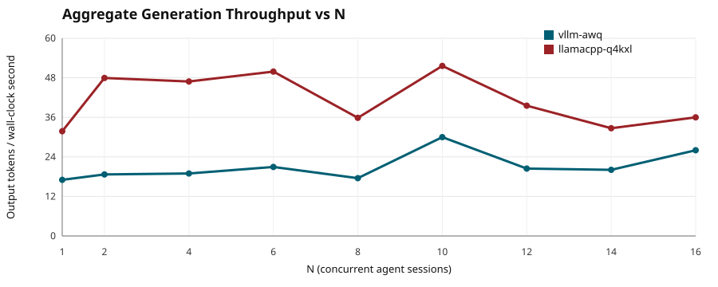
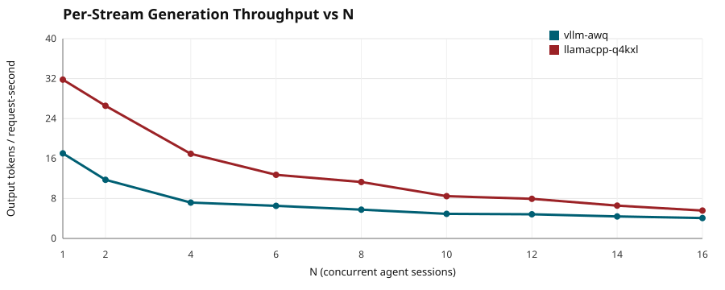
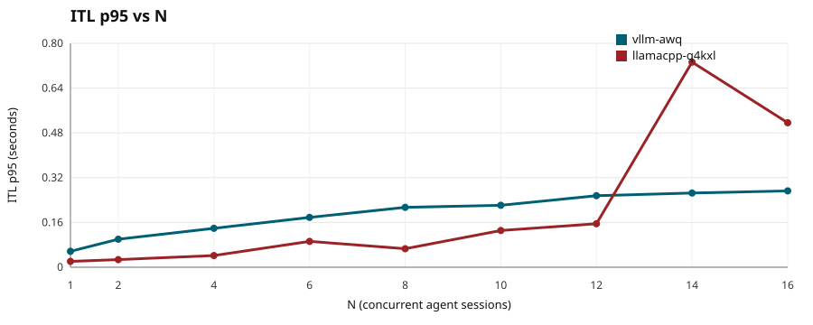
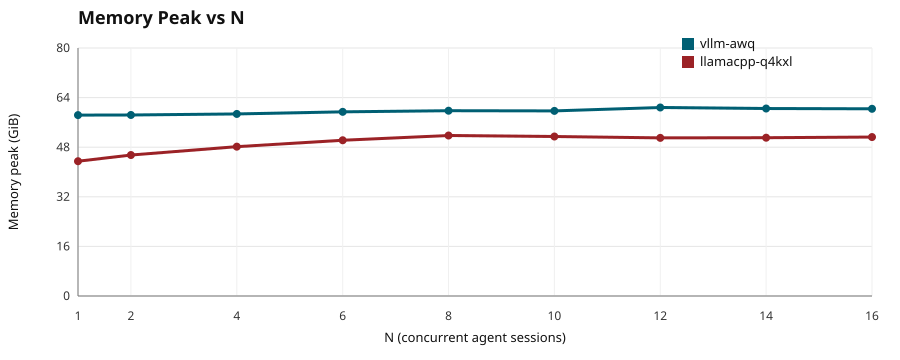

# LLama.cpp vs vLLM: Local Agents Swarm Scaling

This repo answers two practical questions on an AMD Strix Halo 128 GB machine:

> 1. How many concurrent local Qwen 3.6 35B A3B agent sessions can run before degradation ?
>
> 2. Is the simplicity of llama.cpp enough or do you really need to deal with vLLM?

The default run compares vLLM vs Llama.cpp

- `vllm-awq`: vLLM serving `cyankiwi/Qwen3.6-35B-A3B-AWQ-4bit`
- `llamacpp-q4kxl`: llama.cpp `llama-server` serving Unsloth `Qwen3.6-35B-A3B-UD-Q4_K_XL.gguf`

Those model quants aren't *exact* counterpart, but close enough in the 4.x bit/param zone.

## Performance Results

These are from May 16, 2026 UTC on AMD Strix Halo 128 GB with the Qwen3.6 35 billion parameter, Mixture of Experts with 3B active params. They show how various performance metrics scale with additional agents. `N`: number of concurrent simulated agent workers. Power profile was set to performance mode, with about 160 watts at the wall and GPU temperature around 65 C.

> [!NOTE]
> **Main surprise:** llama.cpp does better than expected compared to vLLM 🙂
> The answers to my original concerns are 
> 1. For long worker sessions, it's actually very usable, even upto 8 individual agentic workloads!
> 2. When setup properly, Llama.cpp is very good with overall throughout, model load times, both per-steam and overall aggregate throughput. The one place it's behind vLLM is on time to first token but its literally a negligible sub-half-second difference!
> Personally these are all just tools but ...
> ### Llama.cpp is the winner here 🏆
> 

Key findings from the `N = 1, 2, 4, 6, 8, 10, 12, 14, 16` run:

- Both stacks completed every tested concurrency level with 100% request success.
- vLLM kept TTFT p95 flatter at high concurrency, ending at 3.09s at `N=16`.
- llama.cpp delivered much higher per-stream generation throughput at every tested `N`, but its tail latency degraded harder by `N=16`.
- llama.cpp aggregate throughput peaked around `N=10` at 51.61 output tok/s. vLLM aggregate throughput was noisier and peaked at 29.99 output tok/s at `N=10`.
- The extra midpoints show llama.cpp does not suddenly fall off between `N=8` and `N=16`; the degradation is gradual, with a sharper ITL/tail-latency warning around `N=14+`.

### Time to first token scaling

`TTFT p95` is 95th percentile time to first streamed token. This is the main interactive latency metric. vLLM has the better high-concurrency TTFT shape, while llama.cpp remains usable through `N=16` but with a larger tail.



### Aggregate Throughput Scaling

How much total generation does the server produce as concurrency increases? `Agg gen tok/s` is generated output chunks/tokens divided by the measured wall-clock span for that concurrency level.



### Per-Agent Throughput Scaling

As number of agents scale, how much does each agent get? `Gen tok/s` is generated output chunks/tokens divided by summed successful request duration. This is normalized by request duration, so it approximates per-stream throughput.



### Inter-token latency scaling

`ITL p95`: 95th percentile inter-token latency between streamed output chunks after the first token.



### Memory Peak Scaling

`Memory peak`: host memory used observed around requests from `/proc/meminfo`. Inference-server logs contain additional GPU memory details.



### Result Table

| Inference stack | N | Requests | Success | TTFT p95 | ITL p95 | Gen tok/s/stream | Agg gen tok/s | Memory peak |
|---|---:|---:|---:|---:|---:|---:|---:|---:|
| `vllm-awq` | 1 | 2 | 100% | 0.932s | 0.057s | 17.036 | 17.034 | 58.36 GiB |
| `vllm-awq` | 2 | 4 | 100% | 0.931s | 0.100s | 11.744 | 18.677 | 58.39 GiB |
| `vllm-awq` | 4 | 4 | 100% | 2.106s | 0.139s | 7.178 | 18.966 | 58.73 GiB |
| `vllm-awq` | 6 | 6 | 100% | 1.521s | 0.178s | 6.527 | 20.949 | 59.41 GiB |
| `vllm-awq` | 8 | 9 | 100% | 2.411s | 0.214s | 5.764 | 17.542 | 59.77 GiB |
| `vllm-awq` | 10 | 11 | 100% | 1.639s | 0.221s | 4.925 | 29.994 | 59.71 GiB |
| `vllm-awq` | 12 | 12 | 100% | 2.104s | 0.256s | 4.838 | 20.452 | 60.81 GiB |
| `vllm-awq` | 14 | 14 | 100% | 2.659s | 0.265s | 4.408 | 20.072 | 60.48 GiB |
| `vllm-awq` | 16 | 17 | 100% | 3.092s | 0.273s | 4.083 | 26.020 | 60.39 GiB |
| `llamacpp-q4kxl` | 1 | 5 | 100% | 1.307s | 0.021s | 31.803 | 31.788 | 43.48 GiB |
| `llamacpp-q4kxl` | 2 | 5 | 100% | 1.630s | 0.027s | 26.561 | 47.952 | 45.47 GiB |
| `llamacpp-q4kxl` | 4 | 8 | 100% | 2.391s | 0.042s | 16.946 | 46.883 | 48.17 GiB |
| `llamacpp-q4kxl` | 6 | 8 | 100% | 1.992s | 0.092s | 12.740 | 49.888 | 50.24 GiB |
| `llamacpp-q4kxl` | 8 | 12 | 100% | 3.203s | 0.066s | 11.298 | 35.854 | 51.77 GiB |
| `llamacpp-q4kxl` | 10 | 11 | 100% | 2.156s | 0.131s | 8.467 | 51.610 | 51.45 GiB |
| `llamacpp-q4kxl` | 12 | 15 | 100% | 3.403s | 0.155s | 7.935 | 39.543 | 51.01 GiB |
| `llamacpp-q4kxl` | 14 | 17 | 100% | 3.794s | 0.733s | 6.571 | 32.700 | 51.06 GiB |
| `llamacpp-q4kxl` | 16 | 19 | 100% | 6.942s | 0.516s | 5.586 | 36.002 | 51.27 GiB |


#### Setup

- OS/kernel: Fedora 44 / Silverblue, kernel `7.0.6-200.fc44.x86_64`
- GPU: AMD Radeon 8060S Graphics / gfx1151
- Model family: Qwen 3.6 35B A3B
- Concurrency ramp: `N = 1, 2, 4, 6, 8, 10, 12, 14, 16`
- Timing window per N: 3s warmup, then 15s measured; in-flight requests are allowed to finish. On the shorter side but sufficient for patterns to emerge.
- Workload: real streamed chat completions, 6-turn simulated coding-agent sessions, temperature `0`
- `vllm-awq`: vLLM `0.19.2rc1.dev113+g6aa057c9d.d20260422`, 16k max model length, 16 max sequences, fp8 KV cache, prefix caching, ROCm attention, Triton AWQ kernels
- `llamacpp-q4kxl`: llama.cpp build `b9146-de6562ffc`, 262k total context, 16 parallel slots, continuous batching, unified KV, flash attention, prompt cache, 8 GiB prompt-cache RAM

## Run it yourself

### 1. Clone Repo

```bash
git clone https://github.com/SidShaytay/llama-vs-vllm
cd llama-vs-vllm
```

### 2. Setup Requirements

Common path:

```bash
# Optional: choose a large model cache location.
export HF_HOME=/path/to/your/models

./scripts/setup-requirements.sh
```

This creates the `vllm` and `llama-rocm-7.2.3` toolboxes, verifies the server binaries, and downloads both benchmark models.

Manual equivalent:

```bash
podman image pull docker.io/kyuz0/vllm-therock-gfx1151:stable
toolbox create --image docker.io/kyuz0/vllm-therock-gfx1151:stable vllm

podman image pull docker.io/kyuz0/amd-strix-halo-toolboxes:rocm-7.2.3
toolbox create --image docker.io/kyuz0/amd-strix-halo-toolboxes:rocm-7.2.3 llama-rocm-7.2.3

toolbox run -c vllm vllm --version
toolbox run -c llama-rocm-7.2.3 llama-cli --list-devices
toolbox run -c llama-rocm-7.2.3 llama-server --version

toolbox run -c vllm hf download cyankiwi/Qwen3.6-35B-A3B-AWQ-4bit
toolbox run -c llama-rocm-7.2.3 hf download unsloth/Qwen3.6-35B-A3B-GGUF Qwen3.6-35B-A3B-UD-Q4_K_XL.gguf
```

Before running, make sure nothing else is listening on `localhost:8001` or `localhost:18080`.

### 3. Run the Benchmark

This runs the default full comparison benchmark

```bash
python3 bench.py
```

By default, this uses:

- inference stacks: `vllm-awq`, `llamacpp-q4kxl`
- concurrency: `1,2,4,8,16`
- warmup: 3 seconds per N
- measured window: 15 seconds per N
- output directory: a timestamped child under `results/`

The runner launches each configured inference server, waits until it is actually usable for chat completions, runs the benchmark, then terminates the process it launched. If an endpoint is already healthy before launch, the runner refuses to use it unless that stack explicitly sets `allow_existing: true`; this prevents contamination from a system service such as `llama-swap`.

Useful commands:

```bash
# Default full run across the two working inference stacks.
python3 bench.py

# Single-stack run.
python3 bench.py --only-runtime llamacpp-q4kxl
python3 bench.py --only-runtime vllm-awq

# Short ramp for quick checks.
python3 bench.py --only-runtime vllm-awq --concurrency 1,2,4 --results-dir results/vllm-awq-short

# Smoke test output handling without a model server.
python3 bench.py --config configs/smoke-unreachable.json --results-dir results/smoke

# Optional overload/queueing stress points, excluded from N*.
python3 bench.py --overload-concurrency 20,40
```

> `vllm-fp8` exists as an optional inference-server script but is not in the default comparison. On this Strix Halo/gfx1151 setup it is currently blocked by unsupported FP8 MoE backend support in the tested vLLM/ROCm stack.

## Use A Different Model Or Inference Server

There are two common paths.

### Edit Or Add An Inference Server Script

Inference server scripts are plain shell scripts under `runtimes/`. They should start an OpenAI-compatible server and keep it in the foreground so `bench.py` owns the process lifecycle.

For llama.cpp, copy `runtimes/llamacpp-q4kxl.sh` and change:

- `MODEL`
- `--alias`
- `--port`
- context/parallel/batch settings

For vLLM, copy `runtimes/vllm-awq.sh` and change:

- model name passed to `vllm serve`
- `--port`
- `--max-model-len`
- `--max-num-seqs`
- quantization/cache/backend flags

### Add A Config Entry

Create a JSON config that adds or overrides `runtimes`. Minimal shape:

```json
{
  "primary_concurrency": [1, 2, 4, 8],
  "warmup_duration_s": 3,
  "measure_duration_s": 15,
  "runtimes": [
    {
      "name": "my-runtime",
      "endpoint": "http://localhost:18081/v1",
      "model": "my-served-model-name",
      "command": ["./runtimes/my-runtime.sh"],
      "description": "Short human-readable inference-stack description.",
      "context_description": "Context length, batching, cache, and backend settings.",
      "cleanup_patterns": ["unique process command substring for cleanup"]
    }
  ]
}
```

Then run:

```bash
python3 bench.py --config configs/my-runtime.json
```
